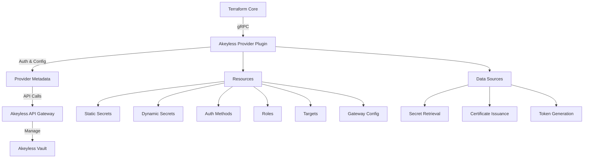
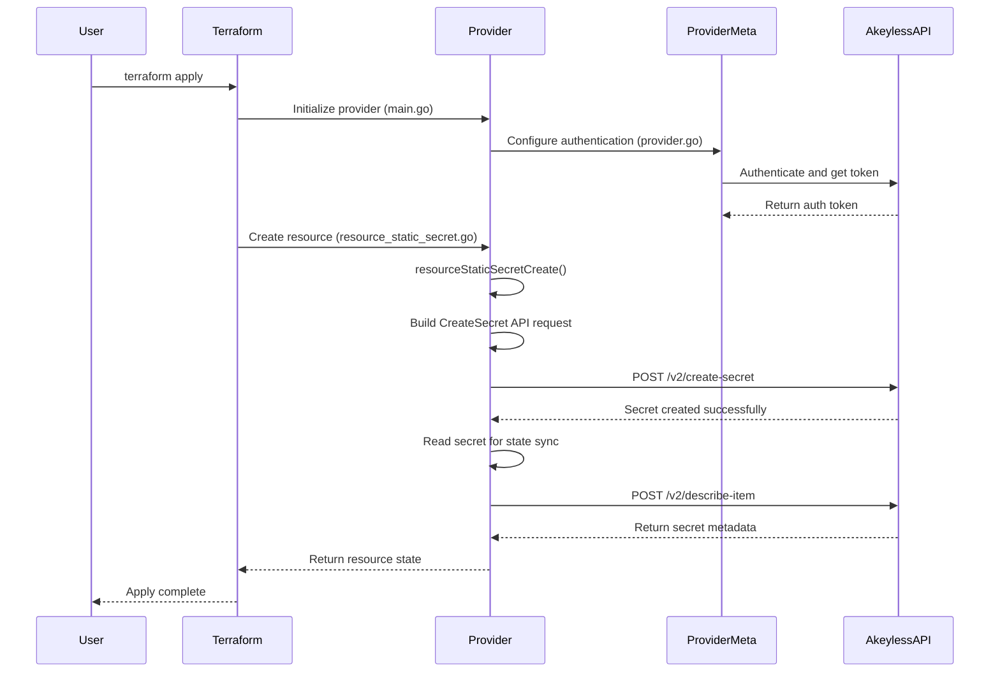

# Codebase Onboarding Guide: Terraform Provider for Akeyless

## High-Level Overview

### Project Purpose
This codebase implements a **Terraform provider for Akeyless**, enabling Infrastructure-as-Code (IaC) management of secrets, credentials, keys, and access controls in the Akeyless platform. It allows DevOps teams to declaratively manage secrets infrastructure using Terraform, including:
- Static and dynamic secrets
- Authentication methods (API Key, AWS IAM, GCP, Azure AD, SAML, OIDC, etc.)
- Role-based access control (RBAC)
- Target systems integration (AWS, Azure, GCP, databases, Kubernetes, etc.)
- Certificate issuers (PKI, SSH)
- Gateway configurations and log forwarding
- Secure remote access settings

### Technology Stack
- **Language**: Go 1.24.4
- **Framework**: HashiCorp Terraform Plugin SDK v2
- **Primary Dependencies**:
  - `github.com/hashicorp/terraform-plugin-sdk/v2` - Terraform provider framework
  - `github.com/akeylesslabs/akeyless-go` v5.0.8 - Akeyless API client
  - `github.com/akeylesslabs/akeyless-go-cloud-id` - Cloud identity authentication
  - `github.com/hashicorp/terraform-plugin-docs` - Documentation generator
- **Testing**: Go testing framework with Terraform acceptance tests
- **Documentation**: Auto-generated via tfplugindocs

### System Architecture
This is a **Terraform provider plugin** that acts as a bridge between Terraform and the Akeyless API. The architecture follows HashiCorp's plugin system using gRPC for communication.



**Key Components**:
1. **Provider Core** (`provider.go`): Configures authentication and initializes API client
2. **Resources**: CRUD operations for Akeyless objects (secrets, auth methods, roles, targets)
3. **Data Sources**: Read-only data retrieval (get secrets, generate certificates, fetch credentials)
4. **Common Utilities**: Shared helpers for API calls, error handling, type conversions
5. **Authentication Layer**: Multi-method authentication (API Key, AWS IAM, Azure AD, GCP, JWT, SAML, OIDC, Cert)

## Getting Started

### Prerequisites
- **Go** >= 1.15 (recommended: 1.24.4)
- **Terraform** >= 1.0.0
- **Make** (for build automation)
- **Akeyless Account** with API credentials
- **Git** for version control

### Installation

1. **Clone the repository**:
```bash
git clone https://github.com/akeylesslabs/terraform-provider-akeyless.git
cd terraform-provider-akeyless
```

2. **Install Go dependencies**:
```bash
go mod download
```

3. **Build the provider**:
```bash
# For Linux
make build-linux

# For macOS (Intel)
make build-darwin

# For macOS (Apple Silicon)
make build-darwin-m1
```

4. **Install locally for development**:
```bash
# For Linux
make install-linux

# For macOS (Intel)
make install-darwin

# For macOS (Apple Silicon)
make install-darwin-m1
```

This installs the provider to `~/.terraform.d/plugins/` for local Terraform usage.

### How to Run

#### Using the Provider in Terraform

Create a `main.tf` file:

```hcl
terraform {
  required_providers {
    akeyless = {
      version = "1.0.0-dev"  # For local dev
      source  = "akeyless-community/akeyless"
    }
  }
}

provider "akeyless" {
  api_gateway_address = "https://api.akeyless.io"
  
  api_key_login {
    access_id  = "your-access-id"
    access_key = "your-access-key"
  }
}

resource "akeyless_static_secret" "example" {
  path  = "/terraform/my-secret"
  value = "my-secret-value"
}
```

Then run:
```bash
terraform init
terraform plan
terraform apply
```

#### Running Tests

**Unit Tests**:
```bash
make test
```

**Acceptance Tests** (requires Akeyless credentials):
```bash
export AKEYLESS_ACCESS_ID="your-access-id"
export AKEYLESS_ACCESS_KEY="your-access-key"
make testacc
```

**Format Check**:
```bash
make fmtcheck
```

**Code Formatting**:
```bash
make fmt
```

**Static Analysis**:
```bash
make vet
```

#### Generating Documentation

After making changes to resources or data sources:
```bash
go generate
```

This runs `tfplugindocs` to auto-generate documentation in the `docs/` directory.

## Codebase Structure

```
terraform-provider-akeyless/
│
├── main.go                    # Entry point - initializes Terraform plugin
├── go.mod / go.sum            # Go module dependencies
├── makefile                   # Build, test, and install automation
├── version                    # Version file for releases
│
├── akeyless/                  # Core provider implementation (165 Go files)
│   ├── provider.go            # Provider definition & authentication
│   ├── login.go               # Authentication method schemas
│   │
│   ├── common/                # Shared utilities
│   │   ├── types.go           # Constants and type definitions
│   │   └── utils.go           # Helper functions (error handling, conversions)
│   │
│   ├── resource_*.go          # Resource implementations (CRUD operations)
│   │   ├── resource_static_secret.go
│   │   ├── resource_auth_method_*.go
│   │   ├── resource_role.go
│   │   ├── resource_dynamic_secret_*.go
│   │   ├── resource_rotated_secret_*.go
│   │   ├── resource_target_*.go
│   │   ├── resource_gateway_*.go
│   │   └── ... (117 resources total)
│   │
│   ├── data_source_*.go       # Data source implementations (read-only)
│   │   ├── data_source_secret.go
│   │   ├── data_source_auth_method.go
│   │   ├── data_source_role.go
│   │   ├── data_source_certificate.go
│   │   └── ... (20+ data sources)
│   │
│   └── *_test.go              # Unit and acceptance tests
│
├── docs/                      # Auto-generated Terraform documentation
│   ├── resources/             # Resource documentation (117 files)
│   ├── data-sources/          # Data source documentation (20 files)
│   └── index.md               # Provider overview
│
├── examples/                  # Example Terraform configurations
│   ├── provider/              # Provider configuration examples
│   ├── resources/             # Resource usage examples
│   └── data-sources/          # Data source usage examples
│
├── templates/                 # Documentation templates
│   └── index.md.tmpl          # Template for provider docs
│
├── scripts/                   # Build and CI scripts
│   └── gofmtcheck.sh          # Format validation script
│
└── tools/                     # Development tools
    └── tools.go               # Tool dependencies
```

### Key Directory Purposes

- **`akeyless/`**: All provider logic resides here. Each file typically corresponds to a single Terraform resource or data source.
- **`docs/`**: Auto-generated markdown documentation consumed by the Terraform Registry.
- **`examples/`**: Reference Terraform configurations demonstrating provider usage. Required for documentation generation.
- **`common/`**: Reusable utilities for API interactions, error handling, type conversions, and authentication.

## Core Concepts & Workflows

### Key Domain Concepts

1. **Provider Authentication**: The provider supports 9 authentication methods:
   - API Key (access_id + access_key)
   - AWS IAM (cloud identity)
   - GCP (cloud identity)
   - Azure AD (cloud identity)
   - JWT/OAuth2
   - SAML
   - OIDC
   - Certificate-based
   - Universal Identity

2. **Secret Types**:
   - **Static Secrets**: Fixed values (passwords, API keys)
   - **Dynamic Secrets**: Auto-generated temporary credentials for external systems
   - **Rotated Secrets**: Automatically rotated credentials with lifecycle management

3. **Resources vs Data Sources**:
   - **Resources**: Manage Akeyless objects (Create, Read, Update, Delete)
   - **Data Sources**: Retrieve data from Akeyless (Read-only)

4. **Target Systems**: External systems that Akeyless integrates with (AWS, Azure, GCP, databases, K8s, etc.)

5. **Authentication Methods**: Define how users/systems authenticate to Akeyless

6. **Roles**: Define permissions and access control policies (RBAC)

### Primary Workflow: Creating a Static Secret

Let's trace how Terraform creates a static secret through the provider:



**Step-by-Step Breakdown**:

1. **Entry Point** (`main.go:12-18`):
   - Terraform calls the provider's `main()` function
   - Initializes the plugin server with `plugin.Serve()`
   - Provides the provider factory function

2. **Provider Configuration** (`provider.go:23-187`):
   - Defines provider schema (authentication methods, API gateway address)
   - Registers all resources and data sources
   - `configureProvider()` function authenticates and creates API client

3. **Authentication** (`provider.go:189-243`, `login.go`):
   - `getProviderToken()` checks for token login or calls `getTokenByAuth()`
   - `getAuthInfo()` validates and extracts login credentials
   - `setAuthBody()` builds authentication request based on login type
   - API call returns authentication token stored in `providerMeta`

4. **Resource Creation** (`resource_static_secret.go`):
   - `resourceStaticSecretCreate()` is invoked
   - Extracts resource configuration from Terraform state
   - Builds `CreateSecret` API request using Akeyless SDK
   - Makes API call via the authenticated client
   - On success, calls `resourceStaticSecretRead()` to sync state
   - Sets resource ID in Terraform state

5. **State Management**:
   - Terraform stores resource ID and attributes
   - On subsequent runs, provider compares desired vs actual state
   - Triggers Update or Delete operations as needed

### Common Development Workflows

#### Adding a New Resource

1. **Create resource file**: `akeyless/resource_my_new_resource.go`
2. **Implement CRUD functions**:
   ```go
   func resourceMyNewResource() *schema.Resource {
       return &schema.Resource{
           Create: resourceMyNewResourceCreate,
           Read:   resourceMyNewResourceRead,
           Update: resourceMyNewResourceUpdate,
           Delete: resourceMyNewResourceDelete,
           Schema: map[string]*schema.Schema{
               // Define fields
           },
       }
   }
   ```
3. **Register in provider**: Add to `ResourcesMap` in `provider.go`
4. **Create example**: `examples/resources/akeyless_my_new_resource/resource.tf`
5. **Generate docs**: Run `go generate`
6. **Write tests**: Create `resource_my_new_resource_test.go`
7. **Bump version**: Update `version` file

#### Adding a New Data Source

1. **Create data source file**: `akeyless/data_source_my_data.go`
2. **Implement Read function** (data sources are read-only)
3. **Register in provider**: Add to `DataSourcesMap` in `provider.go`
4. **Create example**: `examples/data-sources/akeyless_my_data/data-source.tf`
5. **Generate docs**: Run `go generate`

## Suggested Exploration Path

### For New Contributors

1. **Start with the entry point** (`main.go`):
   - Understand how the plugin is initialized
   - See how the provider function is registered

2. **Explore provider configuration** (`provider.go`):
   - Review authentication methods
   - Examine how resources and data sources are registered
   - Understand the `providerMeta` structure

3. **Study a simple resource** (`resource_static_secret.go`):
   - Trace the Create/Read/Update/Delete lifecycle
   - Observe how Terraform schema maps to Akeyless API calls
   - Notice error handling patterns

4. **Examine common utilities** (`common/utils.go`, `common/types.go`):
   - Understand helper functions used across the codebase
   - Review type conversion utilities
   - Study error handling patterns

5. **Review a data source** (`data_source_secret.go`):
   - Understand read-only data retrieval
   - Compare to resource implementation

6. **Check authentication flow** (`login.go`, `provider.go:230-350`):
   - Study multi-method authentication handling
   - Understand cloud identity integration

7. **Run tests** (`*_test.go` files):
   - Execute unit tests to see resource behavior
   - Review acceptance tests for integration examples

8. **Generate documentation**:
   ```bash
   go generate
   ```
   - Observe how examples become documentation

### For Advanced Exploration

- **Complex Resources**: Review `resource_dynamic_secret_aws.go` or `resource_gateway_update_log_forwarding_splunk.go` for advanced patterns
- **Target Integration**: Explore `resource_target_*.go` files to understand external system integration
- **Rotated Secrets**: Check `resource_rotated_secret_*.go` for lifecycle management examples
- **Testing Patterns**: Study `provider_test.go` and `resource_auth_method_test.go` for testing approaches

## Contributing Guidelines

### Code Style
- Follow Go conventions (use `gofmt` and `go vet`)
- Run `make fmtcheck` before committing
- Add comments to exported functions and types

### Documentation Requirements
- **Resource-Level**: Add `Description` field to resource schema
- **Field-Level**: Add `Description` to each schema field
- **Examples**: Create corresponding `.tf` file in `examples/`
- **Auto-Generate**: Run `go generate` to update docs

### Testing Requirements
- Write unit tests for new resources/data sources
- Add acceptance tests for integration scenarios
- Ensure tests pass: `make testacc`

### Versioning
- Follow [semantic versioning](https://semver.org/)
- Update the `version` file with each change
- Version bump is required even for documentation-only changes (immutability principle)

### Pull Request Process
1. Fork the repository
2. Create a feature branch
3. Implement changes with tests and documentation
4. Run `make fmtcheck` and `make testacc`
5. Update `version` file
6. Submit pull request with clear description

## Additional Resources

- **Akeyless Documentation**: https://docs.akeyless.io/
- **Terraform Plugin SDK**: https://developer.hashicorp.com/terraform/plugin/sdkv2
- **Akeyless API Reference**: https://docs.akeyless.io/reference
- **Contributing Guide**: `CONTRIBUTING.md`
- **Terraform Registry**: https://registry.terraform.io/providers/akeyless-community/akeyless/latest

## Quick Reference Commands

```bash
# Build
make build-linux          # Build for Linux
make build-darwin         # Build for macOS Intel
make build-darwin-m1      # Build for macOS Apple Silicon

# Install locally
make install-linux        # Install for Linux
make install-darwin       # Install for macOS Intel
make install-darwin-m1    # Install for macOS Apple Silicon

# Test
make test                 # Run unit tests
make testacc              # Run acceptance tests
make fmtcheck             # Check formatting
make fmt                  # Format code
make vet                  # Run static analysis

# Documentation
go generate               # Generate provider documentation
```

---

**Welcome to the Akeyless Terraform Provider codebase!** This guide should help you get up to speed quickly. Don't hesitate to explore the code, run tests, and experiment with examples. Happy coding! 🚀

